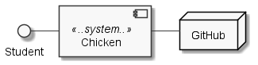

=== Autoren: charzim, wummlamm, danielrieger, winik100
== Chicken-Anwendung

Die Chicken-Anwendung ist ein System zur Verwaltung von Klausur- und Urlaubsbuchungen der Studierenden des Programmierpraktikums
im Bachelor-Modul _Software-Entwicklung im Team_ an der Heinrich-Heine-Universität Düsseldorf.

=== Konfiguration und Start der Anwendung
Die Chicken-Anwendung erfordert, dass ``docker`` sowie ``docker-compose`` installiert sind.

Es wird Gradle als Build-Tool verwendet und die Anwendung sollte nach der Konfiguration mit ``./gradlew bootRun`` gestartet werden.

==== Technische Konfiguration
Basierend auf einem frischen Checkout der Anwendung von Github muss zunächst die Datenbankanbindung gestartet werden.
Dafür reicht es, die mitgelieferte ``docker-compose.yml`` auszuführen.

Weiterhin müssen zur Konfiguration des Github-Logins entweder per Shell oder als Teil der Laufzeit-Konfiguration zwei Umgebungsvariablen gesetzt werden:

****
CLIENT_ID=e1a87c2c14af9dd1a23e

CLIENT_SECRET=a83544990e78c09e9ba6f217ed434ed7aaf3598d
****

==== Fachliche Konfiguration
Um Rollen (Student, Tutor, Admin) für Nutzer anpassen zu können, muss lediglich die ``application.yml`` im Infrastruktur-Modul angepasst werden.
Dort ist eine Eigenschaft ``rollen.*`` definiert, mit der die Zugangsrechte anhand des Github-Handles verändert werden können.
(Hinweis: ist keine andere Rolle konfiguriert, erhält jeder Nutzer automatisch die Rolle Student.)

Zudem können die Praktikumszeiten angepasst werden. In der gleichen Datei finden Sie die Eigenschaft ``praktikumsdauer.*``
über die Sie die täglichen Start- und Endzeiten des Praktikums, sowie den Praktikumszeitraum anpassen können.

[NOTE]
====
Formatierung: 'yyyy-mm-dd', 'hh:mm'
Defaults:

* Praktikumszeitraum: 07.03.2022 bis 01.04.2022

* Zeiten: 09:30 bis 13:30
====

=== Einführung und Ziele

==== Aufgabenstellung

* Klausur- und Urlaubsbuchung für Studierende

* Automatische Validierung der Gültigkeit zu buchender Termine

* Automatische Anpassung von Urlaubsbuchungen an Klausurtermine

* Übersicht über freigestellte Zeiten vom Praktikum

==== Qualitätsziele

|===
| *Qualitätsziel* | *Beschreibung*
| Funktionale Vollständigkeit / Korrektheit | Um keine ungültigen Buchungen zuzulassen (und entsprechend Verwirrung bezüglich Freistellungen zu erzeugen), müssen alle spezifizierten Buchungsregeln abgedeckt und kompatibel sein.
| Testbarkeit | Die Funktionalität des Systems ist sehr stark von der korrekten Umsetzung der Validierungsregeln abhängig.
| Erweiterbarkeit / Modifizierbarkeit | Es ist leicht, dem System weitere Validierungsregeln hinzuzufügen und in Zukunft Funktionalität für andere Stakeholder als Studenten zu implementieren.
| Sicherheit | Ausschließlich authentifizierte Studenten können das System nutzen. Rollenbasierte Authorisierung für potenzielle Funktionalität für Tutoren und Admins.
|===

==== Stakeholder

|===
| Student:innen | Eintragung und Einsicht der gebuchten Termine und Fehlzeiten
| Tutor:innen | Anwesenheitsüberprüfung: Einsicht geplanter Fehlzeiten, Eintragen von tatsächlichen Fehlzeiten der Studierenden (nicht implementiert)
| Organisator:innen | Überprüfung der Fehlzeiten am Praktikumsende (nicht implementiert)
|===

=== Randbedingungen

==== Technische Randbedingungen

|===
| Architektur | Implementierung einer Onion-Architecture
| Konfiguration | Konfigurierbarkeit der Anwendung beim Deployment
| Sicherheit | Authentifizierung und Authorisierung (Student, Tutor, Admin) über OAuth2 mit Github als Provider
| Auditierbarkeit | Implementierung eines Audit-Logs, das alle Anwendungsfälle dokumentiert
| Qualitätssicherung | Continuous Integration via Github Actions
|===

==== Organisatorische Randbedingungen

|===
| Team | Entwicklung in einem Team von 5 Modulteilnehmer:innen
| Zeitplan | In der Zeit vom 07.03.2022 bis 25.03.2022 von Montag bis Freitag jeweils 4 Stunden (9:30 - 13:30)
| Vorgehensmodell | Mob-Programming; testgetriebene Entwicklung (nicht strikt, aber zeitige Tests); Dokumentation mit arc42 und DokChess als Vorbild
| Entwicklungswerkzeuge | IntelliJ als IDE, Gradle, PlantUML
| Versionskontrolle | Git bei Github
|===

==== Konventionen

|===
| Sprache | Deutsch für sämtliche Fachlogik und -objekte
| Code-Richtlinien für Java | Google-Coding-Style mit leichten Abweichungen, geprüft mit Checkstyle
|===

=== Fachlicher Kontext

==== Student (Benutzer)
Studenten müssen mit Klausuren und Urlauben interagieren (d.h., sie hinzufügen und buchen/stornieren) können.
Daher muss das System mit Termin-Eingaben umgehen können.

==== Github (Fremdsystem)
Das System nutzt Github, um Nutzer zu authentifizieren und verwendet die daraus resultierenden Nutzerinformationen zur Verwaltung der Studierenden und ihrer Termine.

=== Lösungsstrategie

==== Einstieg

|===
| *Qualitätsziel* | *Architekturelle Entscheidungen zur Begünstigung*
| Funktionale Vollständigkeit / Korrektheit | Umfangreiches Testen der Buchungslogik; Szenariotests
| Testbarkeit | Kapselung der Validierung für isolierte Tests; Methodendesign mit Blick auf Testbarkeit (z.B. Zeitvalidierung)
| Erweiterbarkeit / Modifizierbarkeit | Kapselung der Validierung erlaubt Hinzufügen weiterer Validierungsmethoden, ohne nötige Änderungen in der Service-Logik; Design der Buchungsmethoden erlaubt einfaches Hinzufügen weiterer Validierungsschritte
| Sicherheit | Konfiguration von SSO via Github, einem vertrauenswürdigen Provider
|===

==== Aufbau
Die Chicken-Application ist als Java Spring Boot Anwendung in Gradle-Submodules umgesetzt, um die Umsetzung der geforderten Onion-Architecture zu erleichtern.
Dabei zerfällt die Anwendung in die Module:

* Domain: Implementierung der Aggregate Klausur und Student (verantwortlich für Urlaube)

* Services: Implementierung der Buchungslogik (BuchungsService) und Validierung (BuchungsValidierung, LsfValidierung)

* Infrastructure: Implementierung der Datenbank-Anbindung (PostgreSQL) und Web-Anbindung

Die Interaktion zwischen Buchungslogik und Fachobjekten ist durch Services für die Aggregate Klausur und Student geregelt.

==== Anbindung
Als Web-Anwendung wurde die grafische Benutzerberfläche mittels HTML und Thymeleaf entworfen. Entsprechend sind alle Funktionalitäten im Front-end als Input-Formulare verschiedener Formen verfügbar.

=== Komponentensicht

|===
| *Subsystem* | *Kurzbeschreibung*
| Web | Erhält die Eingaben des Nutzers, verarbeitet diese und ruft die entsprechenden Methoden im Service-Subsystem auf
| Services (Buchungslogik) | Werden von Controllermethoden aufgerufen und manipulieren Domänenobjekte für aggregatsübergreifende Operationen
| Services (Validierung) | Werden ausschließlich von anderen Services, die Buchungslogik implementieren, aufgerufen um Buchungsszenarien zu prüfen
| Domänenaggregate | Verantwortlich für aggregatsinterne Operationen und Datenmodellierung im Fachkontext
| Repositories | Interaktion mit Datenbank, basierend auf Aufrufen in Services
|===

=== Risiken und technische Schulden

Aufgrund begrenzter Zeit und Priorisierung von Funktionalität gibt es einige Stellen in der Anwendung, die nicht ausgereift sind. Weiterhin existieren Überbleibsel suboptimaler Modellierungsentscheidungen, für deren Verbesserung keine Gelegenheit war.

Darunter fallen:

==== Nicht-funktionale Fehler
Es gibt in der Anwendung keine derzeit implementierte Möglichkeit, registrierte Klausuren (also solche, die zum Registrierungszeitpunkt valide sind) nachträglich zu entfernen.
Außerdem funktioniert die Persistenz von Studierenden über deren GitHub-Handle, d.h. bei Änderung des GitHub-Handles wird ein neuer Eintrag in der Datenbank angelegt.

==== Spring-Dependency in Domain
Um eine sinnvolle Datenbank-Modellierung zu ermöglichen wurde die Entscheidung getroffen, die @Table und @Column Annotationen aus Spring-Data in der Domäne zu benutzen, um die Beziehung zwischen Studierenden und Klausuren korrekt abzubilden.
Dabei wurde jedoch streng beachtet, keinerlei andere Spring-Abhängigkeit in das Domänenmodell einzuführen.

==== Accessiblity
Aufgrund des sehr simplistischen Designs unserer Webseiten haben wir uns entschieden, mehr Zeit in vollständige und korrekte Funktionalität zu investieren.
Dennoch haben wir darauf geachtet, einfache hilfreiche Aspekte von Accessibility (z.B. Kontraste) umzusetzen.
